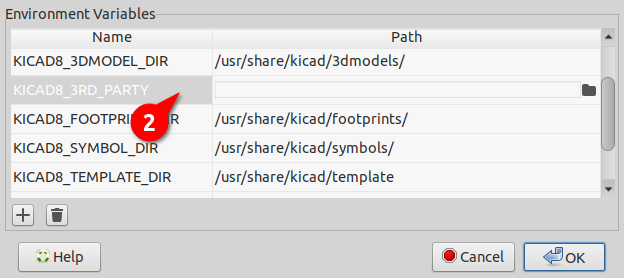

This repository contains the Symbols, Footprint, and 3D Models for the EEZ-DIB projects.
The libraries in this repository are intended to be used with KiCad version 8.

### Installation

You need to download the zip file and install it from the `Plugin and Content Manager` located in KiCad main menu (shortcut `Ctrl+M`).

### Configuration

The installed libraries will be available in the `KICAD8_3RD_PARTY` folder, which you can define under `Preferences -> Configure Paths...` from the KiCad main menu:

All libraries are prefixed with `PCM_` and you can pin them to appear at the top of the library list, for example:

### About KiCad

KiCad is a Cross-Platform and Open Source Electronics Design Automation Suite. See [KiCad EDA](https://kicad.org/) for more information.
